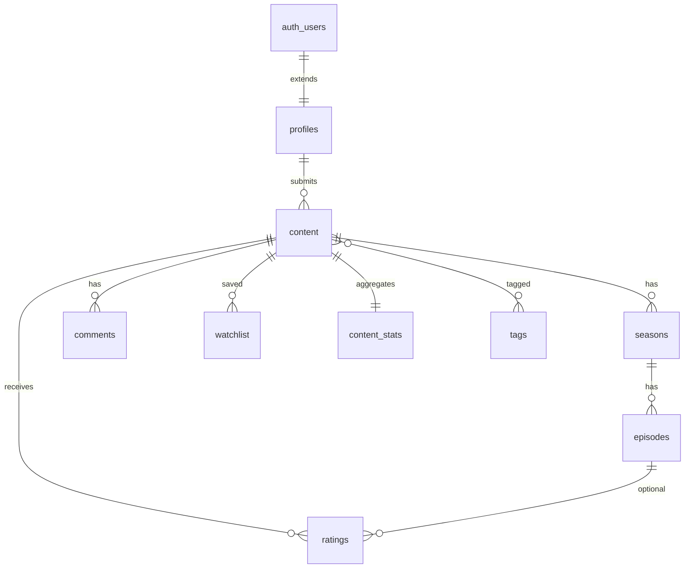

# AICDb — Database Design

PostgreSQL schema for [Supabase](https://zvvkejehuludrsabsesd.supabase.co). Auth uses built-in `auth.users`; app data lives in `public`.

## Entity overview



## Tables

### `profiles`

Extends Supabase Auth. Created automatically on signup via `handle_new_user()`.

| Column | Notes |
|--------|--------|
| `username` | Unique, 3–30 chars, `[a-zA-Z0-9_]` |
| `display_name`, `avatar_url`, `bio` | Optional |

### `content`

Single catalog for **films** and **series** (`content_type`).

| Column | Notes |
|--------|--------|
| `type` | `film` \| `series` |
| `status` | `draft` → `pending` → `published` (or `rejected`) |
| `slug` | URL slug, unique |
| `poster_url`, `synopsis`, `release_year`, `duration_minutes` | Metadata |
| `external_url`, `embed_code` | **Films only** — no file uploads |
| `ai_tools`, `credits` | `text[]` and `jsonb` for AI stack / credits |
| `submitted_by` | Owner |
| `published_at` | Set when status becomes `published` |

**Series:** leave `external_url` and `embed_code` null; playback lives on `episodes`.

### `seasons` / `episodes`

Standard TV structure. Each episode requires `external_url` or `embed_code`.

### `ratings`

Three dimensions (0–5, **0.5 steps**), enforced by `is_half_step_rating()`:

- `visuals`
- `sound_design`
- `script`
- `main_score` — **generated column**: average of the three, stored

| Target | `content_id` | `episode_id` |
|--------|--------------|--------------|
| Film | required | `null` |
| Whole series | required | `null` |
| Single episode | series id | episode id |

One row per user per target (unique indexes).

Optional `review` text (short blurb alongside stars).

### `comments`

Threaded via `parent_id`. Optional `episode_id` for episode threads.

### `watchlist`

`(user_id, content_id)` — per title, not per episode.

### `content_stats`

Maintained by triggers for homepage **engagement** ranking:

```
engagement_score ≈ (
  ratings×3 + comments×2 + watchlists×1 + quality_boost
) / (1 + days_since_activity / 14)
```

Refreshed on rating / comment / watchlist changes and when content is published.

### `tags` / `content_tags`

Normalized tags with slug; many-to-many on content.

## Views

| View | Use |
|------|-----|
| `homepage_trending` | Published titles by `engagement_score` |
| `homepage_newest` | Published titles by `published_at` |

## Security (RLS)

- **Public read:** published content, ratings, comments, profiles, stats, tags.
- **Owners:** edit own submissions (draft/pending), seasons/episodes for own series.
- **Authenticated:** submit content, rate, comment, manage own watchlist.
- **Watchlist:** only visible to the owning user.

Moderation (`pending` → `published`) is not in RLS yet — use Supabase Dashboard / service role or add an `admin` role in a later migration.

## Apply migrations

### Option A — Supabase CLI (recommended)

```bash
npm install -g supabase
supabase login
supabase link --project-ref zvvkejehuludrsabsesd
supabase db push
```

### Option B — SQL Editor

1. Open [Supabase Dashboard](https://supabase.com/dashboard/project/zvvkejehuludrsabsesd/sql) → SQL.
2. Run `supabase/migrations/20250601000000_initial_schema.sql`.
3. Run `supabase/migrations/20250601000001_rls_policies.sql`.

## Example queries

**Trending homepage**

```sql
select id, title, slug, poster_url, rating_avg, engagement_score
from homepage_trending
limit 24;
```

**Newest**

```sql
select id, title, slug, poster_url, published_at
from homepage_newest
limit 24;
```

**Upsert a film rating**

```sql
insert into ratings (user_id, content_id, visuals, sound_design, script)
values (auth.uid(), '<content-uuid>', 4.5, 4.0, 3.5)
on conflict (user_id, content_id) where episode_id is null
do update set
  visuals = excluded.visuals,
  sound_design = excluded.sound_design,
  script = excluded.script,
  updated_at = now();
```

Note: use the partial unique indexes via explicit `delete` + `insert`, or target by `id` after select — Postgres `ON CONFLICT` on partial indexes requires matching the index predicate in app code.

## Next steps (after DB)

1. Generate TypeScript types: `supabase gen types typescript --linked > src/types/database.ts`
2. Cloudflare Worker API or direct Supabase client from the frontend
3. Auth UI (email / OAuth) + profile setup
4. Content submit flow + moderation
5. Film/series detail pages with embed sanitization
